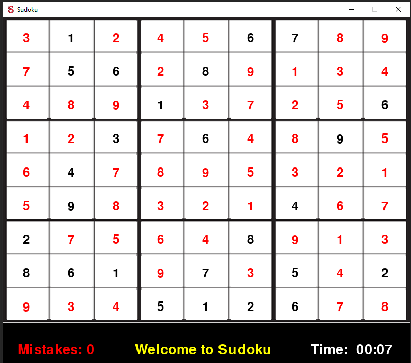

# Sudoku-Solver
Hi, my name is Furkan and this is my simple single player sudoku game built using pygame.
To use: import the play function from the Sudoku_game module. Then provide a delay to be used during the visualization of
the final auto-solving process. It is recommended for the delay to be in the range(0.001, 0.001). Further instructions on how to play the game will be outputted to the Console window. They
will also be printed below:

## Instructions


## Usage

```python
from Sudoku_game import play

# plays the game
play(delay=0.0001)

```

## Example

### Start Menu


### In progress


### During auto-solving


### Completely solved board

## Helpful tips during use
* Sometimes the puzzle can take a couple seconds when you launch the game in which case it would be advised to be patient
or simply restart the game. Often restarting does the trick. 
* During the auto-solving phase it is highly advised to minimize the amount of keyboard or mouse inputs that are given
to the game since during this phase it is performing a relatively more CPU-intensive task

##License
[MIT](LICENSE.txt)
